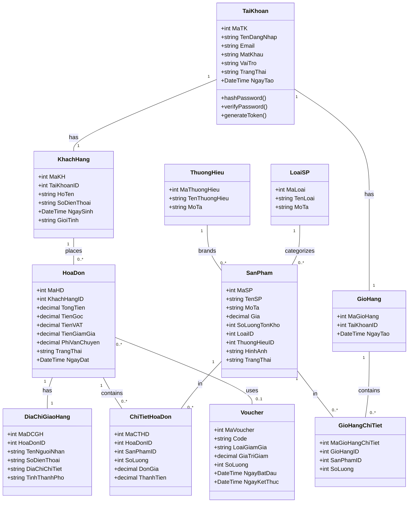
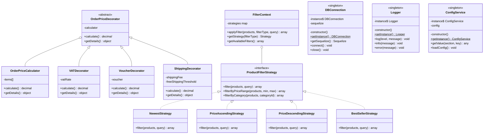
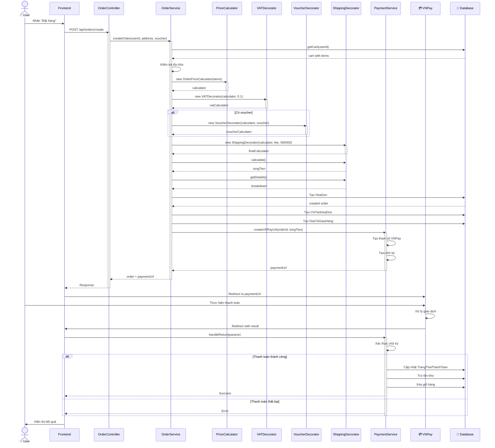
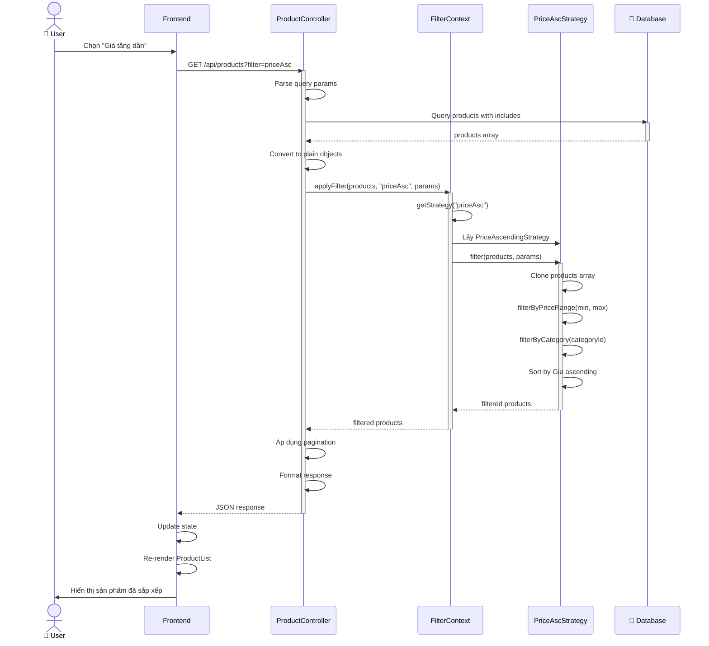
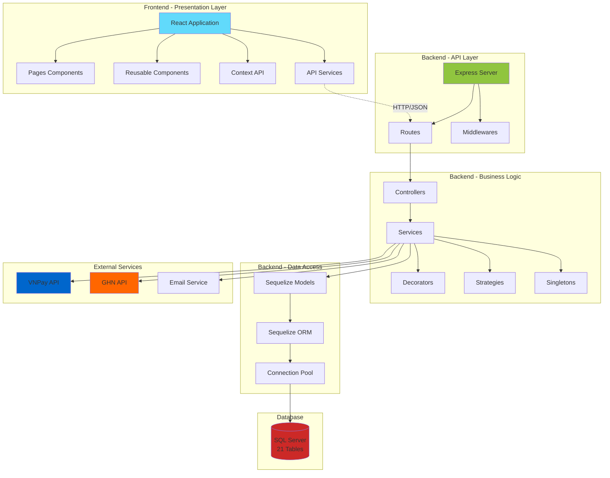
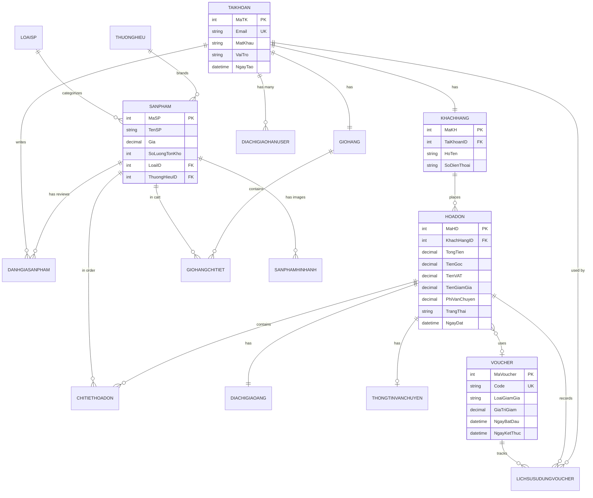
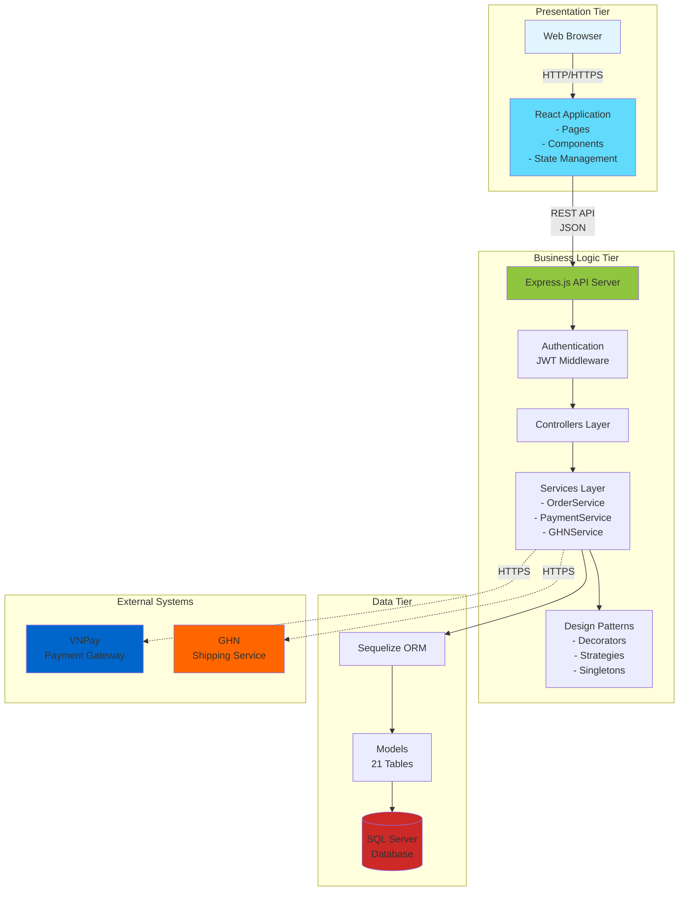

# MERMAID DIAGRAMS CHO TIỂU LUẬN TOYSTORE

Tài liệu này chứa tất cả các Mermaid diagrams cho tiểu luận. Các diagrams này có thể được xem trực tiếp trong các Markdown viewers hỗ trợ Mermaid (như GitHub, VS Code với extension, hoặc Mermaid Live Editor).

---

## 1. USE CASE DIAGRAM

```mermaid
graph TB
    subgraph Actors
        Customer[("👤 Customer<br/>(Khách hàng)")]
        Admin[("👨‍💼 Admin<br/>(Quản trị viên)")]
        Staff[("👨‍💻 Staff<br/>(Nhân viên)")]
        VNPay[("💳 VNPay System")]
        GHN[("🚚 GHN System")]
    end
    
    subgraph "Authentication & User Management"
        UC1["Đăng ký tài khoản"]
        UC2["Đăng nhập"]
        UC3["Quản lý thông tin cá nhân"]
        UC4["Quản lý địa chỉ giao hàng"]
    end
    
    subgraph "Product Management"
        UC5["Xem danh sách sản phẩm"]
        UC6["Tìm kiếm sản phẩm"]
        UC7["Lọc và sắp xếp sản phẩm"]
        UC8["Xem chi tiết sản phẩm"]
        UC9["Đánh giá sản phẩm"]
        UC10["Quản lý sản phẩm (CRUD)"]
    end
    
    subgraph "Shopping Cart"
        UC11["Thêm vào giỏ hàng"]
        UC12["Xem giỏ hàng"]
        UC13["Cập nhật giỏ hàng"]
    end
    
    subgraph "Order Management"
        UC14["Đặt hàng"]
        UC15["Áp dụng voucher"]
        UC16["Thanh toán"]
        UC17["Xem lịch sử đơn hàng"]
        UC18["Hủy đơn hàng"]
        UC19["Quản lý đơn hàng"]
        UC20["Tạo đơn vận chuyển"]
    end
    
    subgraph "Admin Functions"
        UC21["Quản lý người dùng"]
        UC22["Quản lý voucher"]
        UC23["Xem thống kê"]
        UC24["Quản lý danh mục & thương hiệu"]
    end
    
    %% Customer connections
    Customer --> UC1
    Customer --> UC2
    Customer --> UC3
    Customer --> UC4
    Customer --> UC5
    Customer --> UC6
    Customer --> UC7
    Customer --> UC8
    Customer --> UC9
    Customer --> UC11
    Customer --> UC12
    Customer --> UC13
    Customer --> UC14
    Customer --> UC15
    Customer --> UC17
    Customer --> UC18
    
    %% Admin connections
    Admin --> UC2
    Admin --> UC10
    Admin --> UC19
    Admin --> UC20
    Admin --> UC21
    Admin --> UC22
    Admin --> UC23
    Admin --> UC24
    
    %% Staff connections
    Staff --> UC2
    Staff --> UC19
    Staff --> UC20
    
    %% Include relationships
    UC14 -.->|include| UC16
    UC16 -.->|include| VNPay
    UC20 -.->|include| GHN
    
    %% Extend relationships
    UC14 -.->|extend| UC15
    UC5 -.->|extend| UC7
    
    style Customer fill:#e1f5ff
    style Admin fill:#ffe1e1
    style Staff fill:#fff4e1
    style VNPay fill:#e1ffe1
    style GHN fill:#e1ffe1
```

---

## 2. CLASS DIAGRAM - MODELS

---

## 3. CLASS DIAGRAM - DESIGN PATTERNS

---

## 4. SEQUENCE DIAGRAM - LUỒNG ĐẶT HÀNG

---

## 5. SEQUENCE DIAGRAM - LUỒNG LỌC SẢN PHẨM

---

## 6. ACTIVITY DIAGRAM - QUY TRÌNH ĐẶT HÀNG

```mermaid
flowchart TD
    Start([Bắt đầu]) --> Browse[Duyệt sản phẩm]
    Browse --> AddCart[Thêm vào giỏ hàng]
    AddCart --> ViewCart[Xem giỏ hàng]
    ViewCart --> Decision1{Có muốn<br/>đặt hàng?}
    
    Decision1 -->|Không| End([Kết thúc])
    Decision1 -->|Có| Checkout[Nhấn Đặt hàng]
    
    Checkout --> EnterAddress[Nhập địa chỉ giao hàng]
    EnterAddress --> Decision2{Có mã<br/>voucher?}
    
    Decision2 -->|Có| EnterVoucher[Nhập mã voucher]
    EnterVoucher --> ValidateVoucher{Voucher<br/>hợp lệ?}
    ValidateVoucher -->|Không| ShowError1[Hiển thị lỗi]
    ShowError1 --> Decision2
    ValidateVoucher -->|Có| ApplyVoucher[Áp dụng voucher]
    ApplyVoucher --> CalcPrice
    
    Decision2 -->|Không| CalcPrice[Tính giá đơn hàng<br/>Decorator Pattern]
    
    CalcPrice --> ShowBreakdown[Hiển thị chi tiết giá]
    ShowBreakdown --> Confirm[Xác nhận thanh toán]
    
    Confirm --> CreateOrder[Tạo đơn hàng trong DB]
    CreateOrder --> SaveDetails[Lưu chi tiết đơn hàng]
    SaveDetails --> CreatePaymentURL[Tạo URL thanh toán VNPay]
    CreatePaymentURL --> RedirectVNPay[Chuyển hướng đến VNPay]
    
    RedirectVNPay --> UserPay[Người dùng thanh toán]
    UserPay --> VNPayProcess[VNPay xử lý giao dịch]
    
    VNPayProcess --> Decision3{Thanh toán<br/>thành công?}
    
    Decision3 -->|Không| PaymentFailed[Chuyển về với lỗi]
    PaymentFailed --> ShowError2[Hiển thị thông báo lỗi]
    ShowError2 --> Decision4{Thử lại?}
    Decision4 -->|Có| RedirectVNPay
    Decision4 -->|Không| End
    
    Decision3 -->|Có| ReturnSuccess[Chuyển về với kết quả]
    ReturnSuccess --> VerifySignature[Xác thực chữ ký VNPay]
    VerifySignature --> UpdatePayment[Cập nhật trạng thái thanh toán]
    UpdatePayment --> UpdateStock[Trừ tồn kho]
    UpdateStock --> ClearCart[Xóa giỏ hàng]
    ClearCart --> SendEmail[Gửi email xác nhận]
    SendEmail --> ShowSuccess[Hiển thị trang thành công]
    ShowSuccess --> End
    
    style Start fill:#e1f5ff
    style End fill:#e1f5ff
    style Decision1 fill:#fff4e1
    style Decision2 fill:#fff4e1
    style Decision3 fill:#fff4e1
    style Decision4 fill:#fff4e1
    style CalcPrice fill:#e1ffe1
    style VNPayProcess fill:#ffe1e1
```

---

## 7. COMPONENT DIAGRAM

---

## 8. ERD DIAGRAM (Simplified)

---

## 9. ARCHITECTURE DIAGRAM - 3-TIER

---

## HƯỚNG DẪN SỬ DỤNG

### Xem diagrams:
1. **GitHub:** Upload file này lên GitHub, diagrams sẽ tự động render
2. **VS Code:** Cài extension "Markdown Preview Mermaid Support"
3. **Mermaid Live Editor:** Copy code vào https://mermaid.live/
4. **Obsidian:** Hỗ trợ Mermaid native

### Export diagrams:
1. Sử dụng Mermaid Live Editor để export PNG/SVG
2. Sử dụng Mermaid CLI: `mmdc -i input.mmd -o output.png`
3. Screenshot từ preview

### Chỉnh sửa:
- Thay đổi text trong các node
- Thêm/bớt relationships
- Điều chỉnh màu sắc với `style` directive
- Thay đổi hướng graph: `TB` (top-bottom), `LR` (left-right)

---

**Lưu ý:** Một số diagram phức tạp (như Class Diagram đầy đủ) có thể cần chia nhỏ hoặc đơn giản hóa để Mermaid render tốt. Nếu cần diagrams chi tiết hơn, nên sử dụng PlantUML hoặc Draw.io.
